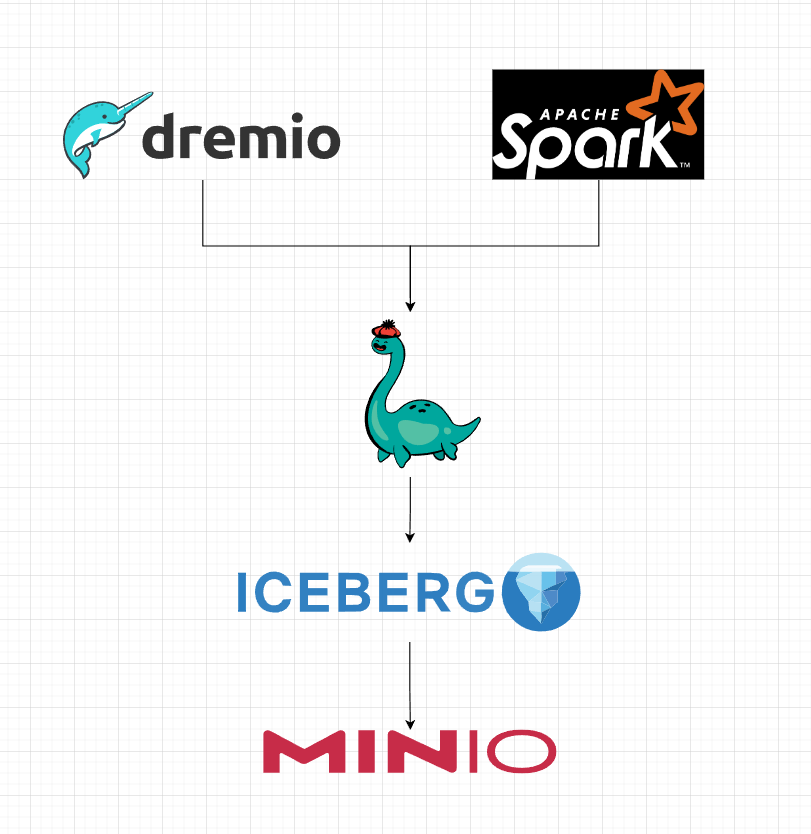

# Prepare data from yellow_trip_2023

```bash
> mkdir datasets
> mkdir minio-data-nessie
```

```bash
> curl https://d37ci6vzurychx.cloudfront.net/trip-data/yellow_tripdata_2023-01.parquet -o ./datasets/yellow_tripdata_2023-01.parquet
```

---
## After downloaded. start services
```bash
> docker-compose up -d
```

## Step
- go to minio address for create access_key, secret_key
- In spark jupyter notebook replace access_key, secret_key
- In DreamIO create connection nessie